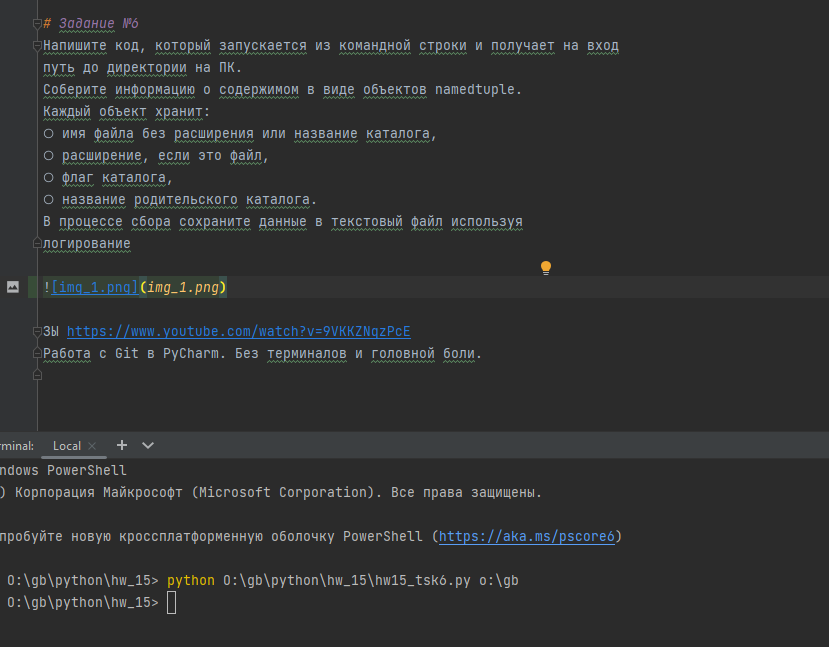

# DeepPython_Seminar15
Промежуточная аттестация 

# Задание №2
На семинаре про декораторы был создан логирующий
декоратор. Он сохранял аргументы функции и результат её
работы в файл.
Напишите аналогичный декоратор, но внутри используйте
модуль logging.  'deco_class_8_ex.py',  'deco_class_8_ex.log'

Решить задание 6, не решенное на семинаре
Взять любую задачу и настроить в ней запуск скрипта с параметрами. (используем Пайчарм и модуль argparse)

# Задание №6
Напишите код, который запускается из командной строки и получает на вход
путь до директории на ПК.
Соберите информацию о содержимом в виде объектов namedtuple.
Каждый объект хранит:
○ имя файла без расширения или название каталога,
○ расширение, если это файл,
○ флаг каталога,
○ название родительского каталога.
В процессе сбора сохраните данные в текстовый файл используя
логирование.

ЗЫ https://www.youtube.com/watch?v=9VKKZNqzPcE
Работа с Git в PyCharm. Без терминалов и головной боли.

PPS

Здравствуйте.
(автотестирование https://gb.ru/lessons/407718/homework 
Погружение в Python (семинары)
Урок 14. Основы тестирования ).
задача 1 - Класс Rectangle - работа с прямоугольниками doctest

Код отправляемый на "выполнение" и "проверку" разные: при проверке берется какая-то старая версия файла-постобработки исходника из кеша.
на листинге после проверки обратите внимание на названия переменных:
в тестах r31 & r32, а в "Ожидаемый ответ: r3" : 'Класс Rectangle - работа с прямоугольниками doctest HW14_TSK1.PY.pdf'.